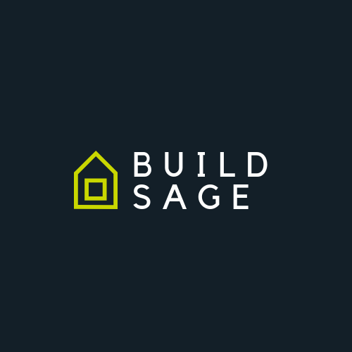
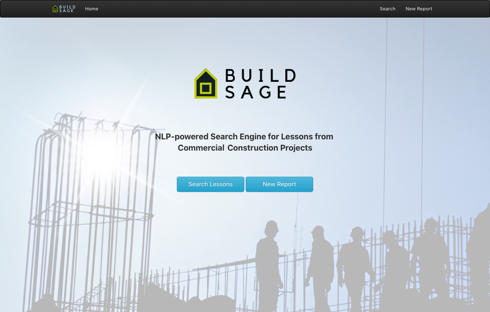
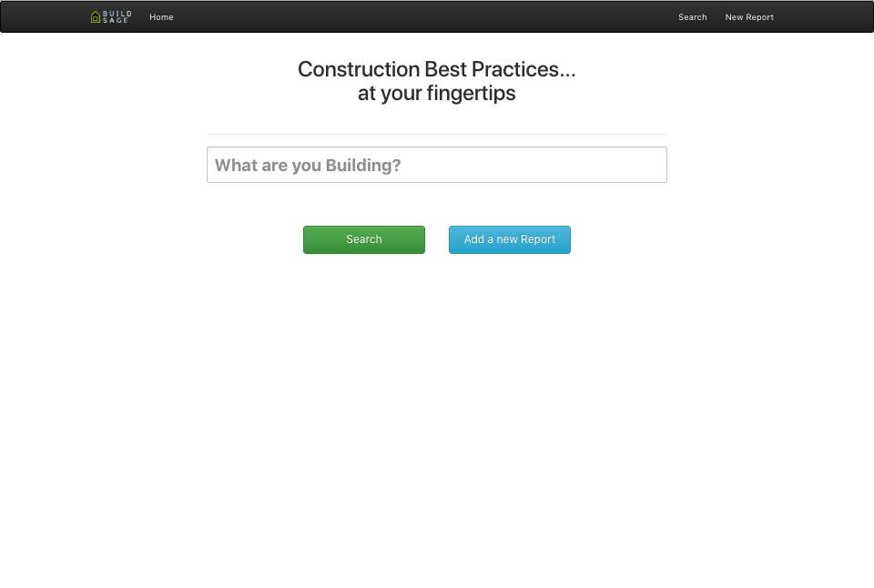
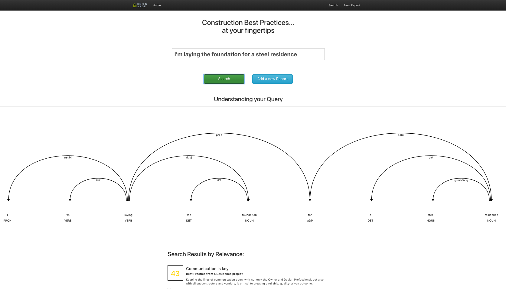
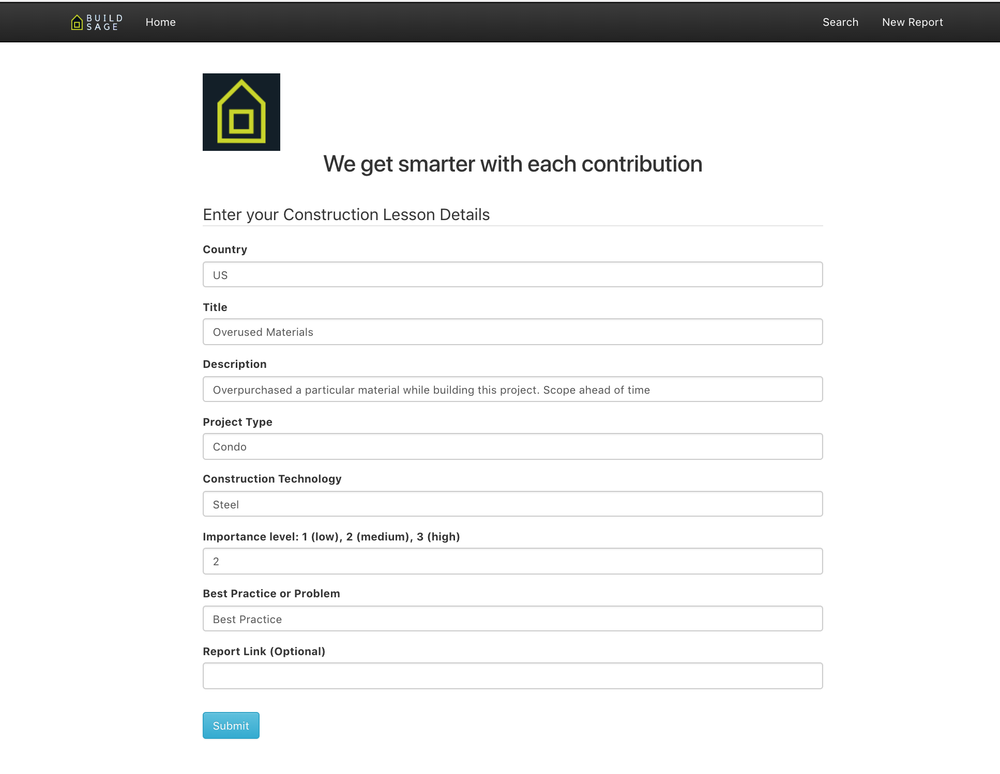

  

BuildSage
---

BuildSage leverages NLP and AI to bring the most pertinent "lessons learned" to attention from past construction experiences.

## Inspiration

Construction companies are often considered project-based organizations, since much of their knowledge is generated on site, as a result of projects they physically carry out. Unfortunately, the learnings from these projects are often kept internal, which can easily lead to other teams and companies repeating the same mistakes. Completing projects gives valuable know-how and organizational knowledge, but the lessons learned from them might still not systematically incorporated into subsequent projects, evidencing a lack of knowledge sharing and learning. This project establishes an open and collaborative community where construction groups can share and overcome these traditional limitations to project review and standardization.

Aggregating these results could not only improve efficiency, cost savings, and time for future efforts, but also result in improved safety for future repeated projects.

## What it does
Uses a combination of NLP and fuzzy search to parse through a database of uploaded lessons learned from past construction experiences. This app is able to interpret and decompose human-written sentences to deliver search results that match the core meaning of a desired construction project.

Users can then contribute back to the platform and submit new lessons that can be discovered by other users.

## Screenshots

<h4>Home page</h4>
  

<h4>Search page</h4>
  

<h4>Example query and parsing</h4>
  

<h4>Uploading a new indexed Report</h4>
  

## How I built it
Uses a python backend to search through an collection of construction reports based on the user's query. Escalates the most pertinent reports for the given task up to the user based on a parsed version of the request.

Fields of relevance currently used for consideration of different lessons learned. These could be expanded in future work.

<pre>
  Title: Theme of the Construction Report
  Description: More detailed information, or abstract
  Project Type: Type of the construction project
  Country: Currently just U.S.
  Construction Technology: Materials used, equipment, etc.
  Importance level: low (1), medium (2), high (3)
  Experience Type: Best Practice, Problem, or Both
  Report Link: URL to the original report document
</pre>

## Challenges I ran into
Gathering data and implementing the NLP/search such that pertinent results could be returned for a query.

## Accomplishments that I'm proud of
It works.

## What I learned
How to deploy an NLP model and connect it to a live, running website.

## What's next for BuildSage
* Release to the public and collect more build reports that can be indexed and returned in search results.

### Running the app
The app requires both the backend (python) server and webserver (react) to be running. The backend server starts with a small base set of construction best practices that can be searched.

To start the python server:
<pre>
  pip install -r requirements.txt
  python app.py
</pre>

</pre>
To start the web server, use the following command:
<pre>
  yarn && yarn start
</pre>

The web server should now be running on port `3000` (with the backend python server on port `8080`).

### Example Searches
* I'm building a condo for a commercial application
* I'm laying the foundation for a new residence
* etc..

### Useful Links
* https://github.com/explosion/spacy-services/tree/master/displacy
* https://github.com/explosion/spacy-services

### Construction Lesson/Report Resources
* https://www.designingbuildings.co.uk/wiki/Lessons_learned_report_for_building_design_and_construction
* https://www.sciencedirect.com/science/article/pii/S1877042816308783
* http://www.horstconstruction.com/lessons-challenging-construction-project/
* https://pdfs.semanticscholar.org/presentation/862e/cc1f7c6d6d5e7003a4ed4abbb6e7da72dfbc.pdf
* https://www.probuilder.com/home-building-25-lessons-learned
* https://www.qaqc-construction.com/library-lessons-learned.php